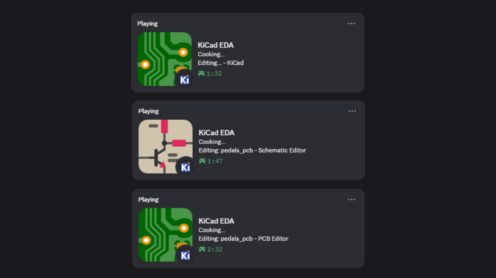

# KiCad Discord Presence

Show your KiCad work in Discord Rich Presence.  
The app runs quietly in the background on Windows and updates your activity while KiCad is open.

## ✨ Features

- 🎯 Detects when KiCad is running
- 🧩 Detects active editor from the focused KiCad window:
- `PCB Editor`
- `Schematic Editor`
- 📝 Shows editing status like: `Editing: <file> - <editor>`
- 💤 Falls back to a generic KiCad state when not in an editor window
- 🖼️ Uses different Discord artwork for PCB vs Schematic editor
- 🚀 Auto-starts with Windows (current user)

## ✅ Requirements

- 🪟 Windows
- 💬 Discord desktop app running
- 🔓 Discord Activity Privacy enabled (so activity can be shown)

## 📦 Install

1. Open **Releases**.
2. Download `KiCadDiscordPresence-Setup.exe`.
3. Run the installer.

Installed path: `%LOCALAPPDATA%\KiCadPresence`  
Auto-start entry: `HKCU\Software\Microsoft\Windows\CurrentVersion\Run`

## 🗑️ Uninstall

- Use Windows **Apps & Features**, or
- Run the uninstaller from `%LOCALAPPDATA%\KiCadPresence`.

Uninstall removes:
- App files
- Auto-start registry entry
- Running `KiCadPresence.exe` process (automatically)

## 🛠️ Troubleshooting

- If VS Code activity overrides KiCad status, disable VS Code in Discord **Registered Games**.
- If activity is not shown, check Discord **Activity Privacy** settings.
- If Discord was started after this app, restart `KiCadPresence` once.
